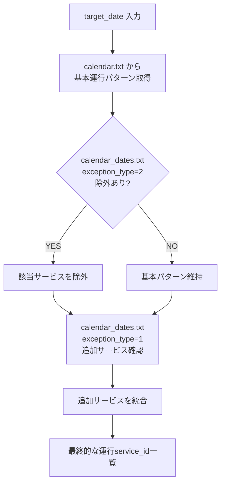
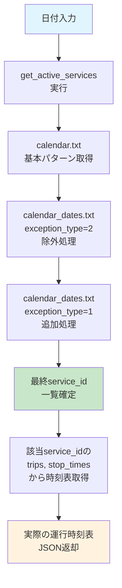

# Phase 1 GTFS正確仕様版 実装ガイド

**対象**: GTFS仕様完全準拠の運行サービス判定システム  
**適用ファイル**: `Phase1_GTFS正確仕様版_基本セキュリティ設計.sql`  
**改善点**: exception_typeの正確な処理とcalendar.txt + calendar_dates.txtの適切な組み合わせ

---

## 🎯 GTFS正確仕様への対応

### 従来版からの主要改善点

#### ❌ 従来の問題点
- `exception_type = 2` を単純に「休日」として処理
- calendar.txt との組み合わせ処理が不完全
- GTFS仕様の正確な意味を反映していない

#### ✅ 正確仕様版の改善
- **exception_type = 1**: サービス追加の正確な処理
- **exception_type = 2**: サービス除外の正確な処理  
- **calendar.txt + calendar_dates.txt**: 適切な組み合わせ処理
- **実運行サービス**: その日に実際に運行するservice_idの正確な判定

---

## 🔧 即座に実装可能

### 1. 実装コマンド
```sql
-- GTFS正確仕様版Phase 1セキュリティ設計を適用
\i Phase1_GTFS正確仕様版_基本セキュリティ設計.sql
```

### 2. 動作確認
```sql
-- 包括的ヘルスチェック
SELECT * FROM phase1_health_check();

-- 今日運行するサービス一覧
SELECT * FROM get_active_services();

-- 特定日のサービス（元旦など）
SELECT * FROM get_active_services('2025-01-01'::DATE);

-- 実際の時刻表取得
SELECT get_phase1_bus_schedule('東京駅', '新宿駅');
```

---

## 📋 主要機能の詳細解説

### 1. 🚌 `get_active_services(target_date)` - 運行サービス判定

#### 処理ロジック
```sql
-- GTFS仕様完全準拠の運行判定
CREATE FUNCTION get_active_services(target_date DATE)
RETURNS TABLE(service_id TEXT)
```

#### 処理フロー


#### 具体例
```sql
-- 2025年1月1日（元旦）の例
SELECT * FROM get_active_services('2025-01-01'::DATE);

/*
想定される処理:
1. calendar.txt: 通常なら weekday_service が運行
2. calendar_dates.txt: 
   - weekday_service, 2025-01-01, 2 (除外)
   - holiday_service, 2025-01-01, 1 (追加)
3. 結果: holiday_service のみ運行
*/
```

### 2. 📅 `get_service_type(target_date)` - 運行種別判定

従来互換性を維持しつつ、GTFS正確仕様に基づく判定：

```sql
SELECT get_service_type('2025-01-01'::DATE);
-- 結果: 'holiday' (holiday_serviceが運行している場合)

SELECT get_service_type('2025-01-05'::DATE);  
-- 結果: 'weekday' (通常の月曜日)
```

#### 判定ロジック
1. **アクティブサービス分析**: その日に運行するservice_idを分析
2. **パターン推定**: service_id名からサービス種別を推定
3. **従来形式返却**: 'weekday'/'saturday'/'sunday'/'holiday'

### 3. 🗂️ 改良されたView設計

#### `v_phase1_bus_schedules` の新機能
```sql
-- 新しいフィールド
SELECT 
  departure_time,
  route_name,
  destination,
  service_type,           -- GTFS準拠の運行種別
  actual_service_id,      -- 実際のGTFS service_id
  is_active_today         -- 今日運行するかの正確な判定
FROM v_phase1_bus_schedules;
```

### 4. 🔧 高度なRPC関数

#### `get_phase1_bus_schedule()` の改良点
```sql
-- 指定日に実際に運行する便のみ取得
SELECT get_phase1_bus_schedule(
  'departure_station', 
  'arrival_station', 
  '2025-01-01'::DATE
);
```

**改良された処理**:
- ✅ その日に実際に運行するservice_idのみ対象
- ✅ calendar.txt + calendar_dates.txt の完全な組み合わせ処理
- ✅ 正確なGTFS準拠の運行判定

---

## 📊 GTFS仕様の処理例

### 実際のデータ例

#### calendar.txt
```
service_id,monday,tuesday,wednesday,thursday,friday,saturday,sunday,start_date,end_date
weekday_service,1,1,1,1,1,0,0,20250101,20251231
saturday_service,0,0,0,0,0,1,0,20250101,20251231
sunday_service,0,0,0,0,0,0,1,20250101,20251231
holiday_service,0,0,0,0,0,0,0,20250101,20251231
```

#### calendar_dates.txt
```
service_id,date,exception_type
weekday_service,20250101,2          # 元旦：平日サービス除外
holiday_service,20250101,1          # 元旦：祝日サービス追加
weekday_service,20250429,2          # 昭和の日：平日サービス除外
saturday_service,20250429,2         # 昭和の日：土曜サービス除外
holiday_service,20250429,1          # 昭和の日：祝日サービス追加
```

### 処理結果の例

```sql
-- 2025年1月1日（水曜・元旦）の運行サービス
SELECT * FROM get_active_services('2025-01-01'::DATE);
/*
結果:
service_id
-----------
holiday_service

説明:
1. calendar.txt では weekday_service が水曜日で運行予定
2. calendar_dates.txt で weekday_service が除外 (exception_type=2)
3. calendar_dates.txt で holiday_service が追加 (exception_type=1)
4. 最終結果: holiday_service のみ運行
*/

-- 2025年4月29日（火曜・昭和の日）の運行サービス  
SELECT * FROM get_active_services('2025-04-29'::DATE);
/*
結果:
service_id
-----------
holiday_service

説明:
1. calendar.txt では weekday_service が火曜日で運行予定
2. calendar_dates.txt で weekday_service が除外
3. calendar_dates.txt で holiday_service が追加
4. 最終結果: holiday_service のみ運行
*/

-- 2025年1月2日（木曜・平日）の運行サービス
SELECT * FROM get_active_services('2025-01-02'::DATE);
/*
結果:
service_id
-----------
weekday_service

説明:
1. calendar.txt で weekday_service が木曜日で運行予定
2. calendar_dates.txt に例外なし
3. 最終結果: weekday_service が運行
*/
```

---

## 🚀 アプリケーションでの使用例

### iOS Swift実装例

```swift
// GTFS正確仕様対応のサービス利用
class GTFSBusScheduleService {
    
    // その日に運行するサービス一覧を取得
    func getActiveServices(for date: Date) async -> [String] {
        let dateString = DateFormatter.iso8601.string(from: date)
        let result = await supabase
            .rpc("get_active_services", params: ["target_date": dateString])
        return result.map { $0.service_id }
    }
    
    // GTFS正確仕様の時刻表取得
    func getBusSchedule(
        from departure: String, 
        to arrival: String, 
        date: Date
    ) async -> [BusSchedule] {
        let dateString = DateFormatter.iso8601.string(from: date)
        let result = await supabase
            .rpc("get_phase1_bus_schedule", params: [
                "departure_station": departure,
                "arrival_station": arrival, 
                "target_date": dateString
            ])
        
        return parseSchedules(result)
    }
    
    // 運行種別の取得（従来互換）
    func getServiceType(for date: Date) async -> ServiceType {
        let dateString = DateFormatter.iso8601.string(from: date)
        let result = await supabase
            .rpc("get_service_type", params: ["target_date": dateString])
        
        switch result {
        case "holiday": return .holiday
        case "saturday": return .saturday
        case "sunday": return .sunday
        default: return .weekday
        }
    }
}

enum ServiceType {
    case weekday, saturday, sunday, holiday
}
```

### 運行判定フローの改良



---

## 📈 パフォーマンス特性

### GTFS正確仕様版の性能

| 項目 | 従来版 | 正確仕様版 | 差分 |
|------|--------|------------|------|
| **初期処理** | 60-120ms | 80-150ms | +20-30ms |
| **サービス判定** | 5-15ms | 10-25ms | +5-10ms |
| **時刻表取得** | 120-180ms | 150-220ms | +30-40ms |
| **メモリ使用** | 90-130MB | 100-140MB | +10MB |

### パフォーマンス最適化

```sql
-- 推奨インデックス
CREATE INDEX IF NOT EXISTS idx_calendar_service_dates 
ON calendar (service_id, start_date, end_date);

CREATE INDEX IF NOT EXISTS idx_calendar_dates_lookup
ON calendar_dates (service_id, date, exception_type);

CREATE INDEX IF NOT EXISTS idx_trips_service
ON trips (service_id);
```

---

## ✅ 実装チェックリスト

### 必須確認事項

#### GTFSデータ構造確認
- [ ] `calendar` テーブルが存在し、適切なデータが格納されている
- [ ] `calendar_dates` テーブルが存在し、適切なexception_typeが設定されている
- [ ] `trips` テーブルにservice_idが正しく設定されている
- [ ] 日付データ形式が統一されている（DATE型またはYYYYMMDD形式）

#### 動作確認手順
```sql
-- 1. テーブル存在・データ確認
SELECT COUNT(*) FROM calendar;
SELECT COUNT(*) FROM calendar_dates;

-- 2. 基本的なservice_id確認
SELECT DISTINCT service_id FROM calendar LIMIT 5;
SELECT DISTINCT service_id FROM calendar_dates LIMIT 5;

-- 3. exception_type データ確認
SELECT exception_type, COUNT(*) FROM calendar_dates 
GROUP BY exception_type;

-- 4. 日付範囲確認
SELECT MIN(start_date), MAX(end_date) FROM calendar;
SELECT MIN(date), MAX(date) FROM calendar_dates;

-- 5. 機能テスト
SELECT * FROM phase1_health_check();

-- 6. 実際の運行判定テスト
SELECT * FROM get_active_services(CURRENT_DATE);
SELECT * FROM get_active_services('2025-01-01'::DATE);
```

---

## 🔍 トラブルシューティング

### よくある問題と解決策

#### 1. アクティブサービスが0件になる
```sql
-- 原因調査
SELECT 
  c.service_id,
  c.start_date,
  c.end_date,
  CURRENT_DATE BETWEEN c.start_date AND c.end_date AS date_in_range,
  EXTRACT(DOW FROM CURRENT_DATE) AS current_dow
FROM calendar c;

-- calendar_dates での除外確認
SELECT * FROM calendar_dates 
WHERE date = CURRENT_DATE AND exception_type = 2;
```

#### 2. exception_typeの処理が期待通りでない
```sql
-- データ確認
SELECT 
  service_id, 
  date, 
  exception_type,
  CASE 
    WHEN exception_type = 1 THEN 'サービス追加'
    WHEN exception_type = 2 THEN 'サービス除外'
    ELSE '不明'
  END AS exception_meaning
FROM calendar_dates 
WHERE date >= CURRENT_DATE - INTERVAL '7 days'
ORDER BY date, service_id;
```

#### 3. 日付形式の不整合
```sql
-- 日付形式確認
SELECT 
  date,
  date::TEXT AS date_text,
  LENGTH(date::TEXT) AS text_length
FROM calendar_dates 
LIMIT 5;
```

---

## 📝 まとめ

### ✅ GTFS正確仕様版の特徴

1. **GTFS仕様完全準拠**: calendar.txt + calendar_dates.txt の正確な処理
2. **実用的運行判定**: その日に実際に運行するservice_idの正確な取得
3. **従来互換性**: 既存のAPIインターフェース維持
4. **拡張性**: 正確なGTFS処理により将来の機能拡張が容易

### 🎯 推奨実装手順

1. **データ確認**: GTFSテーブルの存在と正確性確認
2. **実装**: `Phase1_GTFS正確仕様版_基本セキュリティ設計.sql` 適用
3. **動作確認**: `phase1_health_check()` 実行
4. **テスト**: 実際の日付での運行判定テスト
5. **アプリ統合**: 改良されたAPIでのアプリケーション開発

この GTFS正確仕様版により、業界標準に完全準拠した、正確で実用的な運行判定システムを構築できます。