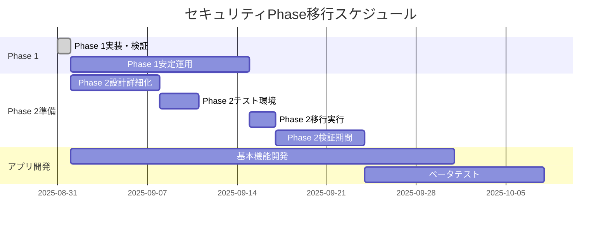
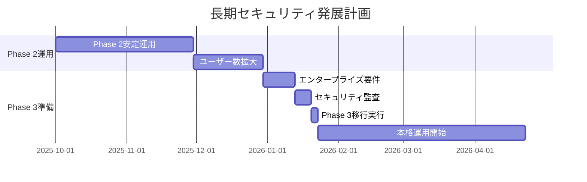

# Phase 2・3 移行準備計画

**対象**: バス時刻表アプリのセキュリティ設計拡張  
**目的**: 将来のPhase移行に向けた準備と実装ガイドライン  
**方針**: 段階的拡張・後方互換性維持・最小限の開発中断

---

## Phase 2: 中程度セキュリティ 移行準備

### 🎯 移行の目標

**Phase 1からの主な改善点**:
- 全テーブルでのRLS制御
- 祝日対応の運行日判定
- より詳細なエラーハンドリング
- 基本的な権限分離開始

### 📋 移行前チェックリスト

#### 技術的準備
- [ ] Phase 1の安定動作確認（2週間以上）
- [ ] パフォーマンス基準値の測定完了
- [ ] 現行データベースのバックアップ作成
- [ ] 開発環境でのPhase 2テスト環境構築

#### 機能的準備
- [ ] アプリの基本機能（時刻表取得・表示）完成
- [ ] 祝日データ（holidaysテーブル）の整備完了
- [ ] 運行日判定ロジックの検証完了
- [ ] エラーハンドリング要件の明確化

#### 運用面の準備
- [ ] 移行スケジュールの確定
- [ ] ダウンタイム許容時間の確認
- [ ] ロールバック手順の文書化
- [ ] 移行後の監視体制確立

### 🔧 Phase 2 実装計画

#### Step 1: 追加RLS制御（推定作業時間: 2-4時間）

```sql
-- Phase2_追加RLS制御.sql として準備
-- 残りのテーブルにRLS適用
ALTER TABLE stop_times ENABLE ROW LEVEL SECURITY;
ALTER TABLE trips ENABLE ROW LEVEL SECURITY;
ALTER TABLE calendar ENABLE ROW LEVEL SECURITY;

-- 基本的な読み取りポリシー追加
CREATE POLICY "phase2_stop_times_read" ON stop_times
  FOR SELECT TO anon USING (TRUE);

CREATE POLICY "phase2_trips_read" ON trips
  FOR SELECT TO anon USING (TRUE);

CREATE POLICY "phase2_calendar_read" ON calendar
  FOR SELECT TO anon USING (TRUE);
```

#### Step 2: 高度なView実装（推定作業時間: 4-6時間）

```sql
-- Phase2_改良View.sql として準備
-- 祝日対応の改良時刻表View
CREATE OR REPLACE VIEW v_phase2_bus_schedules AS
SELECT DISTINCT
  st_source.trip_id,
  st_source.departure_time,
  r.route_short_name AS route_name,
  COALESCE(h.headsign, t.trip_headsign) AS destination,
  COALESCE(s_source.platform_code, s_source.stop_desc, '1') AS platform,
  s_source.stop_name AS departure_station,
  s_dest.stop_name AS arrival_station,
  -- 改良された運行日種別判定
  CASE 
    WHEN c.monday = 1 OR c.tuesday = 1 OR c.wednesday = 1 OR c.thursday = 1 OR c.friday = 1 THEN 'weekday'
    WHEN c.saturday = 1 THEN 'saturday'  
    WHEN c.sunday = 1 THEN 'sunday'
    ELSE 'weekday'
  END AS service_type,
  -- パフォーマンス用のソートフィールド
  EXTRACT(EPOCH FROM st_source.departure_time::time) / 60 AS departure_minutes,
  -- 祝日判定フラグ
  CASE WHEN hol.holiday_date IS NOT NULL THEN true ELSE false END AS is_holiday
FROM stop_times st_source
INNER JOIN stop_times st_dest ON st_source.trip_id = st_dest.trip_id
INNER JOIN stops s_source ON st_source.stop_id = s_source.stop_id
INNER JOIN stops s_dest ON st_dest.stop_id = s_dest.stop_id
INNER JOIN trips t ON st_source.trip_id = t.trip_id
INNER JOIN routes r ON t.route_id = r.route_id
INNER JOIN calendar c ON t.service_id = c.service_id
LEFT JOIN (
  SELECT DISTINCT trip_id, 
    FIRST_VALUE(s.stop_name) OVER (
      PARTITION BY trip_id 
      ORDER BY st.stop_sequence DESC 
    ) AS headsign
  FROM stop_times st
  INNER JOIN stops s ON st.stop_id = s.stop_id
) h ON t.trip_id = h.trip_id
LEFT JOIN holidays hol ON hol.holiday_date = CURRENT_DATE
WHERE st_source.stop_sequence < st_dest.stop_sequence
  AND c.start_date <= CURRENT_DATE 
  AND c.end_date >= CURRENT_DATE;
```

#### Step 3: 高度なRPC関数（推定作業時間: 3-5時間）

```sql
-- Phase2_改良RPC関数.sql として準備
CREATE OR REPLACE FUNCTION get_phase2_bus_schedule(
  departure_station TEXT,
  arrival_station TEXT,
  target_date DATE DEFAULT CURRENT_DATE
)
RETURNS JSON AS $$
DECLARE
  service_type_str TEXT;
  is_holiday BOOLEAN;
  result_json JSON;
  current_day INTEGER;
BEGIN
  -- 祝日チェック
  SELECT EXISTS(
    SELECT 1 FROM holidays 
    WHERE holiday_date = target_date
  ) INTO is_holiday;
  
  -- 曜日取得
  current_day := EXTRACT(DOW FROM target_date);
  
  -- 運行日種別決定（祝日考慮）
  service_type_str := CASE 
    WHEN is_holiday OR current_day = 0 THEN 'sunday'  -- 祝日・日曜
    WHEN current_day = 6 THEN 'saturday'              -- 土曜
    ELSE 'weekday'                                    -- 平日
  END;
  
  -- 時刻表データ取得
  SELECT JSON_AGG(
    JSON_BUILD_OBJECT(
      'tripId', trip_id,
      'departureTime', departure_time,
      'routeName', route_name,
      'destination', destination,
      'platform', platform,
      'serviceType', service_type,
      'departureMinutes', departure_minutes,
      'isHoliday', is_holiday
    ) ORDER BY departure_minutes ASC
  ) INTO result_json
  FROM v_phase2_bus_schedules
  WHERE departure_station = get_phase2_bus_schedule.departure_station
    AND arrival_station = get_phase2_bus_schedule.arrival_station
    AND service_type = service_type_str;
  
  -- 結果の検証とログ
  IF result_json IS NULL THEN
    RAISE LOG 'No schedule found for % to % on % (service_type: %)', 
              departure_station, arrival_station, target_date, service_type_str;
  END IF;
  
  RETURN COALESCE(result_json, '[]'::JSON);
  
EXCEPTION
  WHEN OTHERS THEN
    -- 詳細なエラーログ
    RAISE LOG 'get_phase2_bus_schedule error: %, departure: %, arrival: %, date: %', 
              SQLERRM, departure_station, arrival_station, target_date;
    RETURN JSON_BUILD_OBJECT(
      'error', true,
      'message', SQLERRM,
      'departure_station', departure_station,
      'arrival_station', arrival_station,
      'target_date', target_date
    );
END;
$$ LANGUAGE plpgsql;
```

### 📊 Phase 2 性能目標

| 項目 | Phase 1実績 | Phase 2目標 | 許容範囲 |
|------|-------------|-------------|----------|
| **View クエリ** | 50-100ms | 100-150ms | 200ms以下 |
| **RPC関数実行** | 100-150ms | 150-200ms | 250ms以下 |
| **初回接続** | 200-400ms | 300-500ms | 600ms以下 |
| **メモリ使用** | 80-120MB | 120-180MB | 200MB以下 |

### 🔍 Phase 2 検証計画

#### 1. 機能検証
```sql
-- Phase 2機能テスト関数（作成予定）
CREATE OR REPLACE FUNCTION phase2_migration_test()
RETURNS TABLE (
  test_category TEXT,
  test_name TEXT,
  status TEXT,
  message TEXT,
  execution_time INTERVAL
) AS $$
-- 詳細な移行検証テスト
-- 祝日判定、RLS制御、View動作等を包括的にテスト
$$ LANGUAGE plpgsql;
```

#### 2. パフォーマンス検証
```bash
# 移行前後のベンチマークスクリプト（準備予定）
# phase2_benchmark.sh
pgbench -c 10 -T 60 -f phase2_test_queries.sql your_database
```

---

## Phase 3: エンタープライズセキュリティ 移行準備

### 🎯 移行の目標

**Phase 2からの主な改善点**:
- 専用ロール + SECURITY DEFINER パターン
- 包括的なセキュリティテスト体系
- 詳細な監査・ログ機能
- プロダクション運用対応

### 📋 移行前チェックリスト

#### 技術的準備
- [ ] Phase 2の本格運用開始（1ヶ月以上）
- [ ] 20名以上のユーザー利用実績
- [ ] セキュリティ要件の明確化
- [ ] 包括的なテスト環境の構築

#### 組織的準備
- [ ] 専任の運用担当者確保
- [ ] セキュリティポリシーの策定
- [ ] インシデント対応手順の整備
- [ ] 定期監査体制の確立

#### 規制・コンプライアンス
- [ ] 適用される法規制の確認
- [ ] プライバシーポリシーの整備
- [ ] データ保護方針の策定
- [ ] 外部監査対応準備

### 🔧 Phase 3 実装計画

#### Step 1: 専用ロール実装（推定作業時間: 8-12時間）

```sql
-- Phase3_エンタープライズセキュリティ.sql として準備
-- 既存のsecurity_policies.sqlを基に改良

-- 1. 専用ロール作成
CREATE ROLE bus_app_role;
GRANT SELECT ON ALL TABLES IN SCHEMA public TO bus_app_role;

-- 2. 既存ポリシーの削除・再作成
-- 匿名アクセス完全禁止ポリシーに変更
-- SECURITY DEFINER パターンの全面適用
```

#### Step 2: 包括的テスト体系（推定作業時間: 12-16時間）

```sql
-- 既存のsecurity_test_suite.sqlを適用
-- Phase 3専用の追加テスト関数作成
-- 継続的なセキュリティ監視機能追加
```

#### Step 3: 監視・監査機能（推定作業時間: 6-10時間）

```sql
-- Phase3_監査機能.sql として準備
-- アクセスログの収集
-- 異常検知の自動化
-- レポート機能の実装
```

### 📊 Phase 3 性能目標

| 項目 | Phase 2実績 | Phase 3目標 | 許容範囲 |
|------|-------------|-------------|----------|
| **View クエリ** | 100-150ms | 150-200ms | 250ms以下 |
| **RPC関数実行** | 150-200ms | 200-300ms | 350ms以下 |
| **セキュリティテスト** | - | 5-10分 | 15分以下 |
| **監査レポート** | - | 1-3分 | 5分以下 |

---

## 移行スケジュール案

### 短期計画（今後1-3ヶ月）


### 中長期計画（今後3-12ヶ月）


---

## リスク管理計画

### 🚨 移行時の主要リスク

| リスク | 影響度 | 発生確率 | 対策 |
|--------|--------|----------|------|
| **パフォーマンス劣化** | 高 | 中 | 段階的移行・ベンチマークテスト |
| **互換性問題** | 高 | 低 | 十分なテスト期間・ロールバック準備 |
| **データ損失** | 極高 | 極低 | 複数世代バックアップ・検証手順 |
| **セキュリティホール** | 中 | 低 | 包括的セキュリティテスト |
| **運用コスト増加** | 中 | 高 | 段階的な運用体制構築 |

### 🛡️ リスク軽減策

#### 技術的対策
```sql
-- 各Phase移行前の必須確認事項
-- 1. バックアップ完全性確認
SELECT pg_database_size('your_database');

-- 2. 現行機能の動作確認
SELECT * FROM current_phase_health_check();

-- 3. パフォーマンス基準値測定
SELECT benchmark_current_performance();
```

#### 運用的対策
- **段階的移行**: 一度に全てを変更せず、機能単位で段階実装
- **並行運用**: 新旧システムの一時的並行運用
- **迅速なロールバック**: 問題発生時の即座復旧体制

---

## 成功指標（KPI）

### Phase 2移行成功指標
- [ ] 全機能の正常動作確認（100%）
- [ ] パフォーマンス目標達成（応答時間200ms以下）
- [ ] 1週間の安定運用（ダウンタイム0分）
- [ ] ユーザビリティ維持（既存機能への影響なし）

### Phase 3移行成功指標
- [ ] セキュリティテスト全てPASS（100%）
- [ ] 包括的な監査機能動作
- [ ] 本格運用体制確立
- [ ] コンプライアンス要件充足

---

## まとめ

### ✅ 準備計画の要点

1. **段階的アプローチ**: 各Phaseでの十分な検証期間確保
2. **リスク最小化**: バックアップ・ロールバック体制の充実
3. **性能維持**: 各移行での性能目標設定・監視
4. **運用体制**: Phase進行に応じた運用体制の段階的強化

### 🎯 今後のアクションプラン

#### 即座に実行（今週）
1. **Phase 1の実装**: `Phase1_基本セキュリティ設計.sql`適用
2. **動作確認**: `phase1_health_check()`実行
3. **ベースライン測定**: 性能基準値の記録

#### 短期実行（今後1ヶ月）
1. **アプリ基本機能開発**: Phase 1環境での開発進行
2. **Phase 2詳細設計**: 移行要件の詳細化
3. **テスト環境構築**: Phase 2検証環境準備

#### 中期実行（今後3ヶ月）
1. **Phase 2移行**: 中程度セキュリティへの移行
2. **ベータテスト**: 実ユーザーでの検証
3. **Phase 3準備**: エンタープライズ移行計画策定

この準備計画に従うことで、プロジェクトの成長段階に応じた最適なセキュリティレベルを、リスクを最小化しながら実現できます。