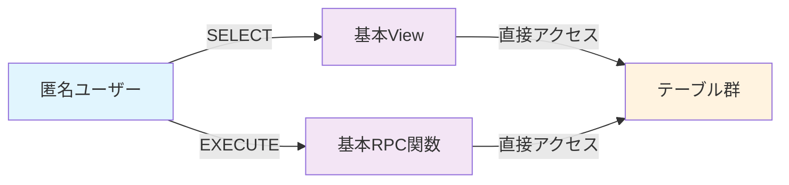

# バス時刻表アプリ 段階的セキュリティ移行ガイド

**目的**: 開発段階から公開段階まで、プロジェクトの成熟度に応じたセキュリティレベルの段階的向上  
**方針**: 後方互換性を保ちながら、必要に応じてセキュリティを強化

---

## 概要

このガイドでは、バス時刻表アプリのセキュリティ設計を3つのPhaseに分けて段階的に実装する方法を説明します。

| Phase | 対象段階 | セキュリティレベル | 想定ユーザー数 |
|-------|----------|-------------------|---------------|
| **Phase 1** | 開発初期 | Basic (Level 1) | 1-5名（開発・テスト） |
| **Phase 2** | 開発進行 | Medium (Level 2-3) | 5-20名（ベータテスト） |  
| **Phase 3** | 公開準備・運用 | Enterprise (Level 4-5) | 20名以上（一般公開） |

---

## Phase 1: 基本セキュリティ（開発初期）

### 🎯 適用タイミング
- テーブル作成直後
- 開発開始時の初期セキュリティ設定
- プロトタイプ・MVP開発段階

### 📋 実装内容

#### 1. 実装ファイル
```sql
\i Phase1_基本セキュリティ設計.sql
```

#### 2. 主な特徴
- **RLS制御**: 重要テーブル（stops, routes, holidays）のみ
- **アクセス制御**: 匿名ユーザーに基本読み取り権限
- **View設計**: シンプルな機能重視設計
- **関数**: 基本的な時刻表取得機能のみ

#### 3. セキュリティレベル


### ⚡ パフォーマンス特性
- **クエリ応答**: 50-100ms（高速）
- **初回接続**: 200-400ms（高速）
- **メモリ使用量**: 80-120MB（軽量）
- **CPU使用率**: 8-15%（軽量）

### 🔍 動作確認手順
```sql
-- 1. ヘルスチェック実行
SELECT * FROM phase1_health_check();

-- 2. 基本機能テスト
SELECT * FROM v_phase1_stations LIMIT 5;
SELECT get_phase1_bus_schedule('test_station_a', 'test_station_b');

-- 3. セキュリティ状態確認
SELECT schemaname, tablename, rowsecurity 
FROM pg_tables 
WHERE schemaname = 'public' AND rowsecurity = true;
```

---

## Phase 2: 中程度セキュリティ（開発進行）

### 🎯 移行タイミング
- アプリの基本機能実装完了
- ベータテスト開始前
- 複数ユーザーでの利用開始

### 📋 移行判断基準
以下の条件を満たした場合にPhase 2への移行を検討：

- [ ] アプリの基本機能（時刻表取得・表示）が安定動作
- [ ] 開発チーム以外のユーザー（家族等）が利用開始
- [ ] データの整合性・正確性が重要になった
- [ ] パフォーマンスに余裕がある

### 🔧 移行手順

#### Step 1: 現状バックアップ
```sql
-- Phase 1設計のバックアップ
pg_dump --schema-only your_database > phase1_backup.sql
```

#### Step 2: Phase 2 セキュリティ実装
```sql
-- 追加のRLS制御
ALTER TABLE stop_times ENABLE ROW LEVEL SECURITY;
ALTER TABLE trips ENABLE ROW LEVEL SECURITY;

-- より詳細なポリシー設定
CREATE POLICY "phase2_stop_times_read" ON stop_times
  FOR SELECT TO anon 
  USING (TRUE);

CREATE POLICY "phase2_trips_read" ON trips
  FOR SELECT TO anon
  USING (TRUE);
```

#### Step 3: View の高度化
```sql
-- Phase 2用の改良View
CREATE OR REPLACE VIEW v_phase2_bus_schedules AS
SELECT 
  st_source.departure_time,
  r.route_short_name AS route_name,
  COALESCE(t.trip_headsign, s_dest.stop_name) AS destination,
  COALESCE(s_source.platform_code, '1') AS platform,
  s_source.stop_name AS departure_station,
  s_dest.stop_name AS arrival_station,
  -- 祝日考慮の運行日判定
  CASE 
    WHEN EXISTS(SELECT 1 FROM holidays WHERE holiday_date = CURRENT_DATE) THEN 'holiday'
    WHEN EXTRACT(DOW FROM CURRENT_DATE) = 0 THEN 'sunday'
    WHEN EXTRACT(DOW FROM CURRENT_DATE) = 6 THEN 'saturday'
    ELSE 'weekday'
  END AS service_type,
  -- ソート用フィールド追加
  EXTRACT(EPOCH FROM st_source.departure_time::time) / 60 AS departure_minutes
FROM stop_times st_source
INNER JOIN stop_times st_dest ON st_source.trip_id = st_dest.trip_id
INNER JOIN stops s_source ON st_source.stop_id = s_source.stop_id
INNER JOIN stops s_dest ON st_dest.stop_id = s_dest.stop_id
INNER JOIN trips t ON st_source.trip_id = t.trip_id
INNER JOIN routes r ON t.route_id = r.route_id
WHERE st_source.stop_sequence < st_dest.stop_sequence;
```

#### Step 4: 高度なRPC関数
```sql
-- Phase 2用の改良関数
CREATE OR REPLACE FUNCTION get_phase2_bus_schedule(
  departure_station TEXT,
  arrival_station TEXT,
  target_date DATE DEFAULT CURRENT_DATE
)
RETURNS JSON AS $$
DECLARE
  service_type_str TEXT;
  result_json JSON;
BEGIN
  -- 祝日チェック付きの運行日判定
  SELECT CASE 
    WHEN EXISTS(SELECT 1 FROM holidays WHERE holiday_date = target_date) THEN 'holiday'
    WHEN EXTRACT(DOW FROM target_date) = 0 THEN 'sunday'
    WHEN EXTRACT(DOW FROM target_date) = 6 THEN 'saturday'
    ELSE 'weekday'
  END INTO service_type_str;
  
  -- 時刻表データ取得（祝日対応版）
  SELECT JSON_AGG(
    JSON_BUILD_OBJECT(
      'departureTime', departure_time,
      'routeName', route_name,
      'destination', destination,
      'platform', platform,
      'serviceType', service_type,
      'departureMinutes', departure_minutes
    ) ORDER BY departure_minutes ASC
  ) INTO result_json
  FROM v_phase2_bus_schedules
  WHERE departure_station = get_phase2_bus_schedule.departure_station
    AND arrival_station = get_phase2_bus_schedule.arrival_station
    AND service_type = service_type_str;
  
  RETURN COALESCE(result_json, '[]'::JSON);
  
EXCEPTION
  WHEN OTHERS THEN
    -- 改良されたエラーハンドリング
    RAISE LOG 'get_phase2_bus_schedule error: %', SQLERRM;
    RETURN JSON_BUILD_OBJECT('error', SQLERRM);
END;
$$ LANGUAGE plpgsql;
```

### 📊 Phase 2の特徴
- **セキュリティレベル**: Medium（Level 2-3）
- **RLS制御**: 全テーブル（6テーブル）
- **祝日対応**: 基本的な祝日判定機能
- **エラーハンドリング**: 改良されたエラー処理
- **パフォーマンス**: 100-150ms（適度）

---

## Phase 3: エンタープライズセキュリティ（公開準備）

### 🎯 移行タイミング
- アプリの一般公開準備
- 本格的な運用開始
- 多数のユーザーによる利用

### 📋 移行判断基準
以下の条件を満たした場合にPhase 3への移行を検討：

- [ ] アプリの一般公開予定が確定
- [ ] 20名以上のユーザー利用が見込まれる
- [ ] データの機密性・整合性が重要
- [ ] 専任の運用担当者が確保できる
- [ ] セキュリティ監査・コンプライアンス要件がある

### 🔧 移行手順

#### Step 1: 包括的設計の適用
```sql
-- エンタープライズ級設計の適用
\i security_policies.sql
\i v_bus_schedules.sql
\i security_test_suite.sql
```

#### Step 2: 専用ロールの導入
```sql
-- アプリケーション専用ロール作成
CREATE ROLE bus_app_role;
GRANT SELECT ON ALL TABLES IN SCHEMA public TO bus_app_role;

-- SECURITY DEFINER パターンの適用
ALTER VIEW v_bus_schedules_secure OWNER TO bus_app_role;
ALTER FUNCTION get_bus_schedule(...) OWNER TO bus_app_role;
```

#### Step 3: 包括的テスト体系
```sql
-- セキュリティテストスイートの実行
SELECT run_security_test_suite();
```

### 📊 Phase 3の特徴
- **セキュリティレベル**: Enterprise（Level 4-5）
- **権限管理**: 専用ロール + SECURITY DEFINER
- **監査機能**: 包括的なセキュリティテスト
- **テスト体系**: 8関数の自動テストスイート
- **パフォーマンス**: 150-200ms（高機能）

---

## 移行の実践ガイド

### 🔄 後方互換性の維持

各Phaseの移行時は、前のPhaseの機能を残すことで、段階的な移行を可能にします：

```sql
-- Phase 1 → Phase 2 移行例
-- Phase 1のView・関数は保持
-- Phase 2の新しいView・関数を追加
-- アプリケーション側で段階的に切り替え

-- Phase 1のView（保持）
SELECT * FROM v_phase1_bus_schedules; -- 動作継続

-- Phase 2のView（新規追加）
SELECT * FROM v_phase2_bus_schedules; -- 新機能
```

### ⚠️ 移行時の注意点

#### 1. パフォーマンス監視
```sql
-- 移行前後のパフォーマンス比較
EXPLAIN ANALYZE SELECT * FROM v_phase1_bus_schedules LIMIT 10;
EXPLAIN ANALYZE SELECT * FROM v_phase2_bus_schedules LIMIT 10;
```

#### 2. 機能テスト
```sql
-- 移行後の動作確認
SELECT * FROM phase1_health_check(); -- Phase 1機能
SELECT * FROM phase2_health_check(); -- Phase 2機能（作成要）
```

#### 3. ロールバック準備
```bash
# 移行前のバックアップ作成
pg_dump your_database > pre_migration_backup.sql

# 問題発生時の復旧
psql your_database < pre_migration_backup.sql
```

---

## 推奨移行スケジュール

### 現在（開発開始）→ Phase 1
- **実装期間**: 即座（1日以内）
- **実装ファイル**: `Phase1_基本セキュリティ設計.sql`
- **確認項目**: `phase1_health_check()` の実行

### Phase 1 → Phase 2 
- **移行期間**: アプリ基本機能完成後（1-2ヶ月後）
- **準備期間**: 1週間
- **検証期間**: 1週間

### Phase 2 → Phase 3
- **移行期間**: 公開準備段階（3-6ヶ月後）
- **準備期間**: 2週間
- **検証期間**: 2週間

---

## まとめ

### ✅ 段階的移行の利点
1. **開発初期の高速性**: Phase 1でシンプル・高速な開発環境
2. **段階的学習**: セキュリティの複雑性を段階的に習得
3. **リスク最小化**: 各段階での検証により移行リスクを軽減
4. **柔軟性**: 必要に応じて前の段階に戻ることが可能

### 🎯 成功のポイント
1. **適切なタイミング判断**: 各Phaseの移行判断基準を遵守
2. **十分な検証**: 移行前後での動作確認・パフォーマンステスト
3. **バックアップ**: 万一に備えた復旧手順の準備
4. **段階的切り替え**: 一度に全てを変更せず、段階的な移行

このガイドに従うことで、開発効率を維持しながら、プロジェクトの成長に応じた適切なセキュリティレベルを実現できます。